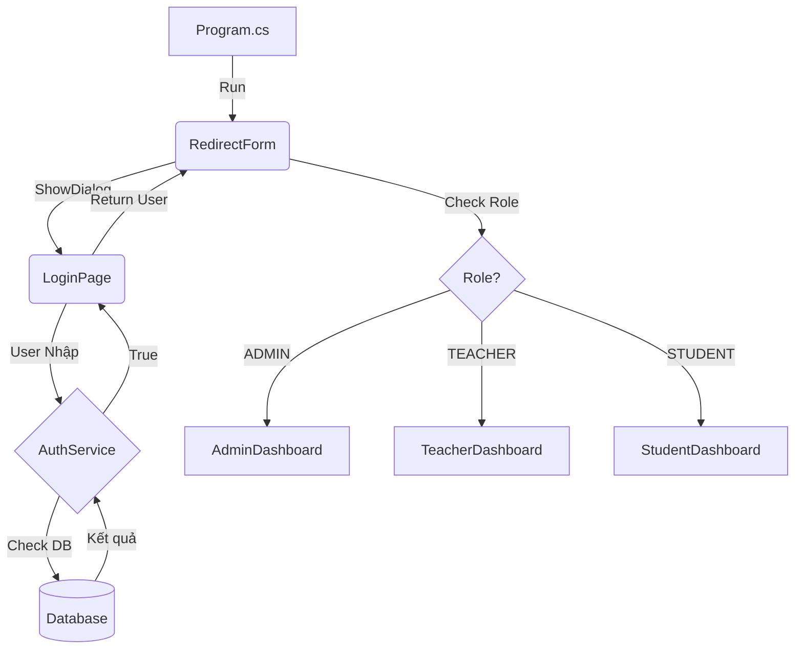

# Cấu Trúc Dự Án CourseGuard

## 1. Tổng Quan Hệ Thống

**CourseGuard** là một ứng dụng quản lý khóa học thi online được xây dựng trên nền tảng **WinForms (.NET Framework/Core)**. Dự án áp dụng kiến trúc **3-Layer Architecture (Kiến trúc phân tầng)** để đảm bảo tính tách biệt, dễ bảo trì và mở rộng.

### Kiến Trúc Phân Tầng (Layered Architecture)
Hệ thống được chia thành 4 phần chính (từ thấp đến cao):
1.  **Core (Lõi)**: Chứa các thực thể (Models) và logic chung nhất, không phụ thuộc vào bất kỳ layer nào khác.
2.  **Infrastructure (Hạ tầng)**: Chứa code truy cập cơ sở dữ liệu (Database Access).
3.  **Application (Ứng dụng)**: Chứa logic nghiệp vụ (Business Logic), là cầu nối giữa UI và Data.
4.  **Presentation (Giao diện)**: Chứa các Form, UserControl tương tác với người dùng.

---

## 2. Giải Thích Chi Tiết Từng Layer

### 🏢 Core Layer (Lõi)
**Vai trò**: Là trung tâm của ứng dụng, định nghĩa các đối tượng dữ liệu và các tiện ích dùng chung.
**Đặc điểm**: Không phụ thuộc vào bất kỳ layer nào khác (Dependency = 0).

*   **`Core/Models/UserModel.cs`**:
    *   **Vai trò**: Định nghĩa đối tượng Người dùng (User) với các thuộc tính như Id, Username, PasswordHash, Role, v.v.
    *   **Sử dụng**: Được dùng ở tất cả các layer để truyền dữ liệu người dùng đi khắp hệ thống.
*   **`Core/Models/CourseModel.cs`**:
    *   **Vai trò**: Định nghĩa đối tượng Khóa học (Course) với các thuộc tính như Name, Description, TeacherId, v.v.
    *   **Sử dụng**: Truyền dữ liệu khóa học giữa Database, Service và UI.
*   **`Core/Security/PasswordHasher.cs`**:
    *   **Vai trò**: Cung cấp hàm băm mật khẩu (SHA256) để bảo mật password người dùng.
    *   **Sử dụng**: Được gọi bởi Service khi tạo user mới hoặc kiểm tra đăng nhập.

### 🏗️ Infrastructure Layer (Hạ tầng)
**Vai trò**: Chịu trách nhiệm làm việc trực tiếp với Cơ sở dữ liệu (SQL Server).
**Phụ thuộc**: `Core` (để biết cấu trúc dữ liệu cần lưu/lấy).

*   **`Infrastructure/Data/DatabaseAction.cs`**:
    *   **Vai trò**: Lớp tiện ích cấp thấp (Helper), chứa chuỗi kết nối (Connection String) và các hàm thực thi SQL cơ bản (`ExecuteQuery`, `ExecuteNonQuery`, `ExecuteScalar`).
    *   **Sử dụng**: Các Repository sẽ gọi class này để chạy lệnh SQL.
*   **`Infrastructure/Data/Repositories/UserRepository.cs`**:
    *   **Vai trò**: Chứa các câu lệnh SQL cụ thể cho bảng `USERS` (SELECT, INSERT, UPDATE, DELETE).
    *   **Sử dụng**: Nhận yêu cầu từ Service, gọi `DatabaseAction` để lấy dữ liệu, rồi chuyển đổi (Map) dữ liệu từ SQL thành `UserModel`.
*   **`Infrastructure/Data/Repositories/CourseRepository.cs`**:
    *   **Vai trò**: Tương tự như UserRepository nhưng dành cho bảng `COURSES`. Chứa logic JOIN bảng để lấy tên giáo viên.
    *   **Sử dụng**: Cung cấp dữ liệu khóa học cho `CourseService`.

### ⚙️ Application Layer (Ứng dụng)
**Vai trò**: Xử lý logic nghiệp vụ (Business Logic) và điều phối luồng dữ liệu. Đây là "bộ não" của ứng dụng.
**Phụ thuộc**: `Core` (dữ liệu), `Infrastructure` (interface repository).

*   **`Application/Interfaces/IUserRepository.cs` & `ICourseRepository.cs`**:
    *   **Vai trò**: Định nghĩa các "hợp đồng" (contract) mà tầng Infrastructure phải tuân thủ.
    *   **Tại sao cần**: Để Service không phụ thuộc trực tiếp vào code SQL cụ thể (Dependency Inversion), giúp dễ dàng thay đổi DB hoặc test.
*   **`Application/Interfaces/IUserService.cs` & `ICourseService.cs`**:
    *   **Vai trò**: Định nghĩa các chức năng mà ứng dụng cung cấp cho UI (ví dụ: `Login`, `GetAllCourses`, `AddStudent`).
*   **`Application/Services/UserService.cs`**:
    *   **Vai trò**: Thực thi logic nghiệp vụ cho User. Ví dụ: khi lấy danh sách giáo viên, nó gọi Repository để lấy dữ liệu thô.
    *   **Hoạt động**: Nhận Repository qua Constructor (Dependency Injection thủ công).
*   **`Application/Services/CourseService.cs`**:
    *   **Vai trò**: Thực thi logic nghiệp vụ cho Course. Ví dụ: Validate dữ liệu trước khi gọi Repository để lưu.
*   **`Application/Services/AuthService.cs`**:
    *   **Vai trò**: Xử lý logic Đăng nhập.
    *   **Logic**: Nhận Username/Password -> Gọi Repository lấy user -> Dùng `PasswordHasher` kiểm tra mật khẩu -> Trả về kết quả.

### 🖥️ Presentation Layer (Giao diện)
**Vai trò**: Hiển thị dữ liệu cho người dùng và nhận tương tác (Click, Type).
**Phụ thuộc**: `Application` (để gọi các chức năng nghiệp vụ), `Core` (để biết cấu trúc dữ liệu hiển thị).
**Quy tắc**: Tuyệt đối không viết câu lệnh SQL ở đây.

*   **`Presentation/Forms/Login/LoginPage.cs`**:
    *   **Vai trò**: Form đăng nhập.
    *   **Hoạt động**: Khi bấm "Login", gọi `AuthService.Login()`. Nếu thành công -> mở Dashboard.
*   **`Presentation/Forms/Admin/AdminDashboard.cs`**:
    *   **Vai trò**: Form chính quản lý (Container), chứa các UserControl con.
*   **`Presentation/UserControls/Admin/UC_UsersManage.cs`**:
    *   **Vai trò**: Màn hình quản lý người dùng (CRUD).
    *   **Hoạt động**: Gọi `UserService` để lấy danh sách user đổ vào DataGridView.
*   **`Presentation/UserControls/Admin/UC_CoursesManage.cs`**:
    *   **Vai trò**: Màn hình quản lý khóa học.
    *   **Hoạt động**: Gọi `CourseService` để lấy danh sách khóa học (kèm tên giáo viên) và `UserService` để lấy danh sách giáo viên cho Dropdown.
*   **`Presentation/UserControls/Admin/UC_AdminReports.cs`**:
    *   **Vai trò**: Màn hình báo cáo thống kê.
*   **`Presentation/Theme/ColorPalette.cs`**:
    *   **Vai trò**: Chứa mã màu chuẩn của ứng dụng để đảm bảo đồng bộ giao diện.

---

## 3. Dependency Flow (Luồng Phụ Thuộc)

Mũi tên thể hiện "Layer A gọi/sử dụng Layer B":

```
Presentation ➡️ Application ➡️ Infrastructure ➡️ Database
      ⬇️             ⬇️               ⬇️
     Core           Core             Core
```

*   **Presentation** chỉ biết **Application** (Services). Nó không biết SQL là gì.
*   **Application** chỉ biết **Infrastructure** thông qua **Interfaces** (Repository). Nó không biết connection string là gì.
*   **Infrastructure** truy cập **Database**.
*   **Core** đứng độc lập, được tất cả các layer khác sử dụng để truyền dữ liệu.

**Tại sao không được ngược lại?** (Ví dụ: Core gọi Presentation)
=> Để tránh "Circular Dependency" (Phụ thuộc vòng tròn). Nếu Core gọi UI, khi thay đổi UI, Core sẽ lỗi, kéo theo cả hệ thống lỗi.

---

## 4. Luồng Xử Lý Tính Năng (Ví dụ)

### 🔐 1. Đăng Nhập (Login)
1.  **UI**: User nhập User/Pass tại `LoginPage`, bấm Login.
2.  **App**: `AuthService` nhận thông tin.
    *   Gọi `UserRepository` để tìm user theo username.
3.  **Infra**: `UserRepository` chạy `SELECT * FROM USERS WHERE ...`. Trả về `UserModel`.
4.  **App**: `AuthService` băm password nhập vào bằng `PasswordHasher`, so sánh với password hash trong `UserModel`.
5.  **UI**: Nếu khớp, `LoginPage` đóng và mở `AdminDashboard`.

### 👥 2. Xóa Người Dùng (Delete User)
1.  **UI**: Admin chọn dòng trong `UC_UsersManage`, bấm nút "Xóa".
2.  **App**: Gọi `UserService.DeleteUser(id)`.
3.  **Infra**: `UserRepository` chạy lệnh `DELETE FROM USERS WHERE ID = @id`.
4.  **UI**: Kiểm tra kết quả trả về. Nếu `true` -> Hiện thông báo thành công và reload lại lưới.

### 📚 3. Tạo Khóa Học Mới (Create Course)
1.  **UI**: Admin nhập Tên khóa, chọn Giáo viên (từ Dropdown), nhập Ngày tháng tại `UC_CoursesManage`.
2.  **UI validate**: Kiểm tra Ngày bắt đầu < Ngày kết thúc.
3.  **App**: Gọi `CourseService.AddCourse(courseModel)`.
4.  **Infra**: `CourseRepository` nhận `CourseModel`, chạy lệnh `INSERT INTO COURSES ...`.
5.  **Database**: Lưu dữ liệu, tự sinh ID mới.
6.  **App**: Trả về ID của khóa học mới.

---

## 5. Các Nguyên Tắc Thiết Kế Đang Áp Dụng

1.  **Separation of Concerns (Phân tách mối quan tâm)**:
    *   UI chỉ lo hiển thị.
    *   Service chỉ lo logic.
    *   Repository chỉ lo SQL.
    *   Giúp code sạch, dễ sửa lỗi (lỗi ở đâu sửa ở đó, không ảnh hưởng cái khác).

2.  **Single Responsibility Principle (Nguyên tắc đơn nhiệm)**:
    *   Mỗi class chỉ làm 1 việc duy nhất.
    *   Ví dụ: `PasswordHasher` chỉ lo băm password, không lo việc lưu vào DB.

3.  **Dependency Inversion (Đảo ngược phụ thuộc)**:
    *   Service không phụ thuộc trực tiếp vào `UserRepository` (class), mà phụ thuộc vào `IUserRepository` (interface).
    *   Giúp dễ dàng thay thế Repository giả (Mock) để test mà không cần DB thật.


---

## 6. Luồng Chạy Của Ứng Dụng (Application Flow)

Dưới đây là sơ đồ mô tả cách ứng dụng khởi chạy và điều hướng người dùng:



**Giải thích chi tiết:**

1.  **Entry Point (`Program.cs`)**:
    *   Ứng dụng bắt đầu chạy từ hàm `Main()`.
    *   Gọi lệnh `Application.Run(new RedirectForm())` để khởi tạo Form điều hướng.

2.  **Điều Hướng (`RedirectForm.cs`)**:
    *   Form này chạy ngầm (Invisible), có nhiệm vụ quản lý vòng đời ứng dụng.
    *   Ngay khi load, nó mở `LoginPage` dưới dạng Dialog (`ShowDialog`).

3.  **Đăng Nhập (`LoginPage.cs`)**:
    *   Người dùng nhập thông tin.
    *   Nếu đăng nhập thành công, `LoginPage` lưu thông tin User vào biến `CurrentUser` và đóng lại (`DialogResult.OK`).

4.  **Phân Quyền (`RedirectForm.cs`)**:
    *   Sau khi `LoginPage` đóng, `RedirectForm` kiểm tra biến `CurrentUser`.
    *   Dựa vào `Role` (ADMIN, TEACHER, STUDENT), nó khởi tạo Dashboard tương ứng.
    *   Dashboard được hiển thị (`ShowDialog`). Khi Dashboard đóng (Logout), vòng lặp có thể quay lại bước Login (tùy logic cài đặt).

5.  **Kết Thúc**:
    *   Khi Dashboard đóng hẳn, `RedirectForm` đóng và ứng dụng kết thúc.


---

## 7. Quan Hệ Thực Thi (Implementation) & Tiêm Phụ Thuộc (Dependency Injection)

Thay vì tập trung vào thừa kế (Inheritance) từ hệ thống, kiến trúc này tập trung vào cách các lớp **Hiện thực hóa (Implement)** các giao diện (Interface) để đảm bảo tính lỏng lẻo (Loosely Coupled).

### A. Hiện thực hóa Interface (Implementation)
Mô tả class nào thực thi interface nào:

1.  **User Domain**:
    *   `Interface`: **IUserRepository** (Application)
        *   `Implementation`: **UserRepository** (Infrastructure)
    *   `Interface`: **IUserService** (Application)
        *   `Implementation`: **UserService** (Application)

2.  **Course Domain**:
    *   `Interface`: **ICourseRepository** (Application)
        *   `Implementation`: **CourseRepository** (Infrastructure)
    *   `Interface`: **ICourseService** (Application)
        *   `Implementation`: **CourseService** (Application)

### B. Sơ đồ Quan Hệ Phụ Thuộc (Dependency Graph)
Dưới đây là cách các thành phần gọi nhau trong thực tế (không phải quan hệ cha-con):

*   **UI Layer** (`UC_CoursesManage`, `UC_UsersManage`)
    *   ⬇️ *Gọi*
    *   **Services** (`ICourseService`, `IUserService`)
    *   ⬇️ *Gọi*
    *   **Repositories** (`ICourseRepository`, `IUserRepository`)
    *   ⬇️ *Gọi*
    *   **DatabaseAction** (Helper)

*Lưu ý: Dự án ưu tiên Composition (chứa đối tượng) hơn Inheritance (kế thừa class).*

---
*Tài liệu này được tạo tự động để hỗ trợ sinh viên trong quá trình phát triển và bảo vệ đồ án.*
