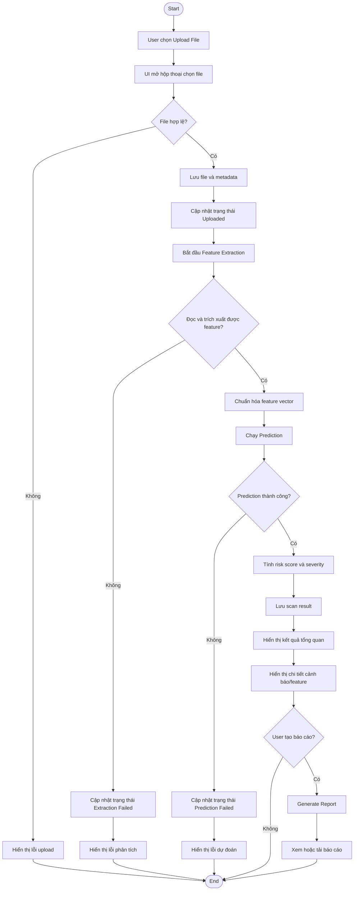

# Activity Flow cho quy trình Upload File, Feature Extraction, Prediction và Result Visualization

Tài liệu này mô tả activity flow cho quy trình phân tích file theo các bước: **upload file**, **feature extraction**, **prediction** và **result visualization**. Nội dung được tổng hợp dựa trên runbook, source code hiện tại và các tài liệu phân tích trong thư mục `docs/report`.

> **Lưu ý phạm vi:** Source code CourseGuard hiện tại là ứng dụng **C# WinForms quản lý khóa học và thi online**, chưa có module scan APK/malware hoàn chỉnh. Vì vậy, phần flow dưới đây được mô tả theo hướng **đặc tả nghiệp vụ/thiết kế đề xuất** dựa trên các use case đã bổ sung như `Upload APK`, `Scan Malware`, `View Result`, `Generate Report`, đồng thời tham chiếu cách tổ chức module hiện có của project.

## 1. Tổng quan Activity Flow

Quy trình tổng quát gồm 4 giai đoạn chính:

```text
User
   |
   v
Upload File
   |
   v
Validate File
   |
   v
Store File / Metadata
   |
   v
Feature Extraction
   |
   v
Prediction
   |
   v
Save Scan Result
   |
   v
Result Visualization
```

Trong mô hình CourseGuard hiện tại, các bước này có thể được ánh xạ vào kiến trúc sẵn có như sau:

| Giai đoạn | Thành phần phù hợp trong kiến trúc hiện tại | Vai trò |
| --- | --- | --- |
| Upload file | WinForms UI, Controller, File Policy/Storage Service | Nhận file từ người dùng, kiểm tra định dạng, lưu file/metadata. |
| Feature extraction | Service xử lý phân tích file | Trích xuất đặc trưng phục vụ dự đoán. |
| Prediction | Service/model phân loại | Đánh giá file an toàn/nguy hiểm hoặc mức độ rủi ro. |
| Result visualization | UserControl/Form, DataGridView, chart/report export | Hiển thị kết quả, cảnh báo và báo cáo cho người dùng. |

## 2. Activity Flow: Upload File

### 2.1. Mục tiêu

Cho phép người dùng chọn và tải file lên hệ thống để chuẩn bị cho quá trình phân tích.

Trong đặc tả trước đó, file được giả định là **APK**. Tuy nhiên, nếu áp dụng vào source CourseGuard hiện tại, flow upload có thể tương tự luồng upload tài liệu học tập hoặc gửi file trong chat: người dùng chọn file từ máy local, hệ thống kiểm tra hợp lệ, sau đó lưu file hoặc lưu nội dung file vào database/storage.

### 2.2. Actor tham gia

- **User**: chọn file và yêu cầu upload.
- **UI/Form**: hiển thị hộp thoại chọn file, thông báo lỗi/thành công.
- **Controller/Service**: kiểm tra nghiệp vụ và điều phối lưu file.
- **Database/Storage**: lưu metadata hoặc nội dung file.

### 2.3. Luồng chính

```text
User chọn chức năng Upload
   -> UI mở hộp thoại chọn file
   -> User chọn file từ máy local
   -> UI kiểm tra file có tồn tại không
   -> Hệ thống kiểm tra định dạng, dung lượng, tên file
   -> Nếu hợp lệ, hệ thống tạo metadata file
   -> Hệ thống lưu file hoặc nội dung file
   -> Hệ thống trả thông báo upload thành công
```

### 2.4. Luồng chi tiết

| Bước | Hoạt động | Thành phần xử lý | Kết quả |
| ---: | --- | --- | --- |
| 1 | Người dùng bấm nút upload/chọn file | UI | Mở hộp thoại chọn file. |
| 2 | Người dùng chọn file cần phân tích | UI | Lấy đường dẫn file local. |
| 3 | Kiểm tra file có tồn tại và đọc được không | UI/Service | File hợp lệ về mặt truy cập. |
| 4 | Kiểm tra extension, dung lượng, định dạng | File Policy/Service | Chấp nhận hoặc từ chối file. |
| 5 | Tạo metadata: tên file, kích thước, loại file, thời gian upload, user upload | Controller/Model | Có dữ liệu mô tả file. |
| 6 | Lưu file vào storage hoặc lưu byte content vào database | Repository/Database | File được lưu trữ để xử lý tiếp. |
| 7 | Trả kết quả upload | UI | Người dùng thấy thông báo thành công/thất bại. |

### 2.5. Nhánh ngoại lệ

| Tình huống | Cách xử lý |
| --- | --- |
| File không tồn tại | Hiển thị thông báo không tìm thấy file. |
| File sai định dạng | Từ chối upload và yêu cầu chọn đúng định dạng. |
| File quá dung lượng cho phép | Từ chối upload và hiển thị giới hạn dung lượng. |
| Lỗi đọc file | Thông báo lỗi truy cập file. |
| Lỗi lưu database/storage | Rollback nếu cần và thông báo upload thất bại. |

## 3. Activity Flow: Feature Extraction

### 3.1. Mục tiêu

Trích xuất các đặc trưng quan trọng từ file đã upload để phục vụ bước dự đoán/phân loại.

Nếu bài toán là scan APK/malware, đặc trưng có thể gồm:

- Thông tin package/app.
- Permission trong manifest.
- API call hoặc hành vi đáng ngờ.
- Signature/certificate.
- Kích thước file, hash file.
- Các indicator như quyền nguy hiểm, service chạy nền, receiver nhạy cảm.

### 3.2. Luồng chính

```text
Hệ thống lấy file đã upload
   -> Kiểm tra trạng thái file
   -> Đọc nội dung file
   -> Trích xuất metadata kỹ thuật
   -> Trích xuất feature phục vụ model/rule
   -> Chuẩn hóa feature vector
   -> Lưu feature hoặc chuyển sang bước prediction
```

### 3.3. Luồng chi tiết

| Bước | Hoạt động | Thành phần xử lý | Kết quả |
| ---: | --- | --- | --- |
| 1 | Lấy file theo `fileId` hoặc đường dẫn lưu trữ | Service/Repository | File sẵn sàng để phân tích. |
| 2 | Kiểm tra file đã upload thành công chưa | Service | Chỉ xử lý file hợp lệ. |
| 3 | Đọc nội dung file | Feature Extraction Service | Có dữ liệu raw để phân tích. |
| 4 | Trích xuất metadata cơ bản | Feature Extraction Service | Tên file, size, hash, loại file. |
| 5 | Trích xuất đặc trưng chuyên biệt | Feature Extraction Service | Permission/API/signature/risk indicator. |
| 6 | Chuẩn hóa dữ liệu đầu vào cho model | Feature Processor | Feature vector hoặc object đặc trưng. |
| 7 | Lưu kết quả trích xuất nếu cần | Database | Có dữ liệu feature để trace/debug. |

### 3.4. Nhánh ngoại lệ

| Tình huống | Cách xử lý |
| --- | --- |
| File bị thiếu hoặc đã bị xóa | Cập nhật trạng thái lỗi và yêu cầu upload lại. |
| File bị hỏng/không đọc được | Ghi nhận trạng thái `Extraction Failed`. |
| Không trích xuất được feature | Trả thông báo dữ liệu không đủ để prediction. |
| Feature thiếu một phần | Có thể tiếp tục prediction nhưng đánh dấu cảnh báo thiếu dữ liệu. |

## 4. Activity Flow: Prediction

### 4.1. Mục tiêu

Dựa trên feature đã trích xuất, hệ thống đưa ra kết quả đánh giá. Với bài toán scan malware, kết quả có thể là:

- File an toàn/nguy hiểm/nghi ngờ.
- Điểm rủi ro.
- Danh sách cảnh báo.
- Nhóm lý do dẫn đến kết luận.

### 4.2. Luồng chính

```text
Nhận feature vector
   -> Kiểm tra feature hợp lệ
   -> Nạp rule hoặc model dự đoán
   -> Thực hiện phân loại
   -> Tính risk score
   -> Tạo kết quả scan
   -> Lưu kết quả vào database
```

### 4.3. Luồng chi tiết

| Bước | Hoạt động | Thành phần xử lý | Kết quả |
| ---: | --- | --- | --- |
| 1 | Nhận feature từ bước extraction | Prediction Service | Có dữ liệu đầu vào. |
| 2 | Validate feature | Prediction Service | Đảm bảo đúng schema/kích thước. |
| 3 | Nạp model/rule phân tích | Prediction Engine | Model/rule sẵn sàng xử lý. |
| 4 | Chạy prediction | Prediction Engine | Kết quả phân loại ban đầu. |
| 5 | Tính điểm rủi ro và mức độ cảnh báo | Prediction Service | Risk score, severity. |
| 6 | Tổng hợp kết quả scan | Controller/Service | Scan result đầy đủ. |
| 7 | Lưu kết quả | Repository/Database | Có lịch sử phân tích để xem lại. |

### 4.4. Nhánh ngoại lệ

| Tình huống | Cách xử lý |
| --- | --- |
| Feature không hợp lệ | Không chạy model, trả lỗi validation. |
| Model/rule không khả dụng | Cập nhật trạng thái `Prediction Failed`. |
| Prediction timeout | Cho phép retry hoặc đưa scan vào trạng thái lỗi. |
| Kết quả không đủ tin cậy | Hiển thị trạng thái nghi ngờ và cảnh báo người dùng. |

## 5. Activity Flow: Result Visualization

### 5.1. Mục tiêu

Hiển thị kết quả phân tích cho người dùng theo cách dễ hiểu, hỗ trợ xem chi tiết và tạo báo cáo.

Trong source CourseGuard hiện tại, cách hiển thị dữ liệu thường dùng:

- `DataGridView` để hiển thị danh sách/bảng kết quả.
- Dashboard/UserControl để hiển thị thông tin theo vai trò.
- Export CSV/Excel/PDF trong màn hình báo cáo Admin.

### 5.2. Luồng chính

```text
User mở màn hình kết quả
   -> UI gửi yêu cầu lấy scan result
   -> Controller truy vấn database
   -> Hệ thống trả dữ liệu kết quả
   -> UI hiển thị tổng quan rủi ro
   -> UI hiển thị chi tiết feature/cảnh báo
   -> User có thể export/generate report
```

### 5.3. Luồng chi tiết

| Bước | Hoạt động | Thành phần xử lý | Kết quả |
| ---: | --- | --- | --- |
| 1 | Người dùng chọn file/kết quả cần xem | UI | Có `scanResultId` hoặc `fileId`. |
| 2 | UI yêu cầu dữ liệu kết quả | Controller | Gửi truy vấn đến repository/database. |
| 3 | Lấy dữ liệu scan result | Repository/Database | Kết quả phân tích được trả về. |
| 4 | Hiển thị tổng quan | UI | Trạng thái an toàn/nguy hiểm, risk score. |
| 5 | Hiển thị chi tiết | UI | Permission, feature, cảnh báo, lý do phân loại. |
| 6 | Người dùng chọn tạo báo cáo nếu cần | UI/Report Service | Báo cáo được tạo/xuất file. |
| 7 | Lưu hoặc tải báo cáo | File System/Printer/Export | File CSV/Excel/PDF/HTML tùy thiết kế. |

### 5.4. Nhánh ngoại lệ

| Tình huống | Cách xử lý |
| --- | --- |
| Chưa có kết quả scan | Hiển thị trạng thái đang xử lý hoặc yêu cầu scan trước. |
| Không tìm thấy result | Thông báo không có dữ liệu. |
| User không có quyền xem | Từ chối truy cập. |
| Lỗi export report | Thông báo lỗi và cho phép thử lại. |

## 6. Activity Diagram đề xuất bằng Mermaid



## 7. Mapping với tài liệu đã có trong `docs/report`

| Tài liệu | Nội dung liên quan đến flow |
| --- | --- |
| `PHAN_TICH_KIEN_TRUC_COURSEGUARD.md` | Cung cấp mô hình lớp: UI → Controller/Service → Data/Repository → Database. |
| `DANH_SACH_CHUC_NANG_COURSEGUARD.md` | Có đặc tả các use case `Upload APK`, `Scan Malware`, `View Result`, `Generate Report`. |
| `PHAN_TICH_USECASE_COURSEGUARD.md` | Cung cấp cách phân chia actor, include/extend và nhóm chức năng nghiệp vụ. |
| `GIOI_THIEU_DE_TAI_COURSEGUARD.md` | Cung cấp bối cảnh, mục tiêu và phạm vi project để trình bày trong báo cáo. |

## 8. Gợi ý trình bày trong báo cáo đồ án

Có thể đưa phần này vào chương **Phân tích thiết kế hệ thống** hoặc **Đặc tả quy trình nghiệp vụ** theo thứ tự:

1. Mô tả ngắn mục tiêu của flow.
2. Trình bày bảng activity flow cho từng giai đoạn.
3. Chèn activity diagram Mermaid hoặc vẽ lại bằng StarUML/Draw.io.
4. Giải thích các nhánh lỗi quan trọng.
5. Liên hệ với kiến trúc CourseGuard: UI, Controller/Service, Repository/Database.

## 9. Kết luận

Activity flow gồm bốn giai đoạn chính: **upload file**, **feature extraction**, **prediction** và **result visualization**. Luồng này phù hợp để mô tả quy trình phân tích file theo hướng scan bảo mật hoặc phân loại rủi ro. Với source code CourseGuard hiện tại, đây nên được xem là **thiết kế đề xuất/đặc tả mở rộng**, vì project hiện chưa có module xử lý APK/malware hoàn chỉnh trong mã nguồn.
