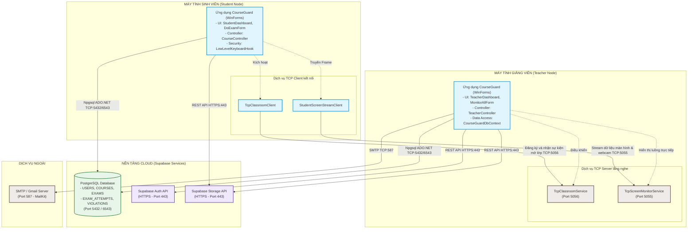
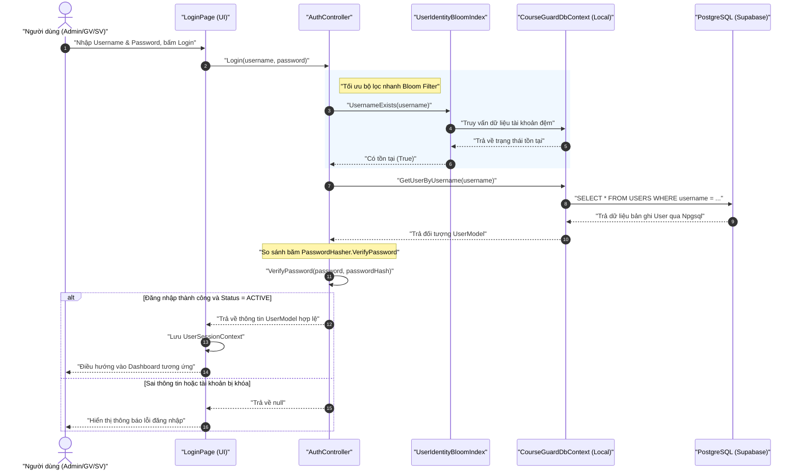
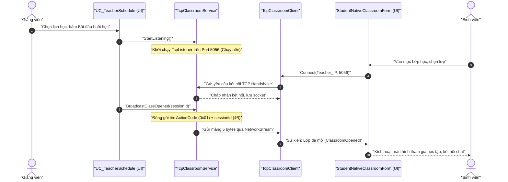

# Sơ đồ Tổng quan và Giao tiếp giữa các thành phần - CourseGuard

Tài liệu này mô tả chi tiết sơ đồ tổng quan hệ thống, các giao thức kết nối, cơ chế giao tiếp mạng và luồng truyền dữ liệu giữa các thành phần trong đồ án **CourseGuard** (Ứng dụng quản lý khóa học và thi trực tuyến chống gian lận).

---

## 1. Sơ đồ Tổng quan Kiến trúc Hệ thống (System Architecture)

CourseGuard được thiết kế theo mô hình **Desktop Monolith** triển khai trên máy khách (Client-side), kết hợp kiến trúc **Client-Server lai P2P (Peer-to-Peer)** cho các tính năng thời gian thực trên mạng LAN/Internet và lưu trữ dữ liệu tập trung trên nền tảng đám mây **Supabase (PostgreSQL & REST APIs)**.

Dưới đây là sơ đồ tổng quan thể hiện cấu trúc và các kênh giao tiếp giữa các thành phần:




### 1.2. Sơ đồ Giao tiếp trực tiếp giữa các Giao diện (UI-to-UI Physical Interaction)

Để làm rõ cách thức các màn hình (Forms) tương tác trực tiếp hoặc gián tiếp với nhau qua đường truyền socket và đồng bộ hóa cơ sở dữ liệu, sơ đồ dưới đây phân rã chi tiết luồng giao tiếp ở cấp độ giao diện người dùng (UI level):

```mermaid
graph TD
    %% Nodes styling %%
    classDef ui fill:#fff9c4,stroke:#fbc02d,stroke-width:2px;
    classDef logic fill:#e1f5fe,stroke:#0288d1,stroke-width:2px;
    classDef service fill:#efebe9,stroke:#5d4037,stroke-width:2px;
    classDef db fill:#e8f5e9,stroke:#2e7d32,stroke-width:2px;

    subgraph TeacherMachineUI ["GIAO DIỆN GIẢNG VIÊN (Teacher UI)"]
        T_Dashboard["TeacherDashboard (Form)<br/>- Theo dõi kết quả và danh sách thi"]:::ui
        T_Monitor["MonitorAllForm / MonitorPopupForm (Form)<br/>- Lưới hiển thị Live Screen các sinh viên"]:::ui
        T_Classroom["TeacherNativeClassroomForm (Form)<br/>- Lớp học online giảng viên"]:::ui
        
        T_ClassroomSrv["TcpClassroomService<br/>(Server port 5056)"]:::service
        T_MonitorSrv["TcpScreenMonitorService<br/>(Server port 5055)"]:::service
    end

    subgraph StudentMachineUI ["GIAO DIỆN SINH VIÊN (Student UI)"]
        S_Dashboard["StudentDashboard (Form)<br/>- Quản lý học tập sinh viên"]:::ui
        S_DoExam["DoExamForm (Form)<br/>- Màn hình thi chống gian lận"]:::ui
        S_Classroom["StudentNativeClassroomForm (Form)<br/>- Lớp học online sinh viên"]:::ui
        
        S_ClassroomCli["TcpClassroomClient"]:::logic
        S_MonitorCli["StudentScreenStreamClient"]:::logic
        S_KeyboardHook["LowLevelKeyboardHook<br/>- Windows Hook chặn Alt+Tab"]:::logic
    end

    subgraph CloudSync ["ĐỒNG BỘ CSDL CLOUD (PostgreSQL)"]
        Table_Violations[("Bảng VIOLATIONS<br/>- Ghi nhận gian lận")]:::db
        Table_Attempts[("Bảng EXAM_ATTEMPTS<br/>- Ghi nhận trạng thái làm bài")]:::db
    end

    %% P2P UI Socket Communications %%
    S_DoExam -->|Khởi chạy luồng chụp| S_MonitorCli
    S_MonitorCli ==>|Gửi gói tin CGSP chứa ảnh Screen/Webcam qua TCP (Cổng 5055)| T_MonitorSrv
    T_MonitorSrv -->|Phát sự kiện FrameReceived| T_Monitor

    T_Classroom -->|Kích hoạt mở phòng| T_ClassroomSrv
    S_Classroom -->|Kích hoạt kết nối| S_ClassroomCli
    S_ClassroomCli ==>|Handshake & Sync đóng/mở lớp qua TCP (Cổng 5056)| T_ClassroomSrv
    T_ClassroomSrv -->|Thông báo lớp mở| S_Classroom

    %% Indirect DB Sync between UIs %%
    S_DoExam -.->|Bắt phím nóng/Mất tiêu điểm| S_KeyboardHook
    S_KeyboardHook -->|Ghi log vi phạm qua Npgsql| Table_Violations
    Table_Violations -.->|Đọc danh sách vi phạm / Cảnh báo realtime| T_Monitor

    S_DoExam -->|Ghi điểm khi nộp bài| Table_Attempts
    T_Dashboard -.->|Xem tiến trình & điểm thi của lớp| Table_Attempts
```

#### Giải thích cơ chế giao tiếp trực tiếp giữa các UI:
1.  **DoExamForm (Student) ↔ MonitorAllForm (Teacher) qua Port 5055:**
    *   Khi sinh viên bắt đầu thi, `DoExamForm` khởi tạo `StudentScreenStreamClient`. Client này định kỳ chụp ảnh màn hình và camera của sinh viên, nén dưới dạng JPEG rồi đóng gói nhị phân (giao thức CGSP) gửi qua cổng `5055`.
    *   Tại máy giảng viên, `MonitorAllForm` khởi chạy `TcpScreenMonitorService` lắng nghe cổng `5055`. Khi nhận được mảng byte dữ liệu ảnh, server giải mã gói tin và kích hoạt sự kiện `FrameReceived`. Giao diện `MonitorAllForm` đăng ký sự kiện này để cập nhật trực tiếp hình ảnh hiển thị của sinh viên lên lưới camera/màn hình thời gian thực.
2.  **StudentNativeClassroomForm (Student) ↔ TeacherNativeClassroomForm (Teacher) qua Port 5056:**
    *   Giảng viên kích hoạt phòng học online trên `TeacherNativeClassroomForm` (hoặc từ lịch trình `UC_TeacherSchedule`), hệ thống khởi chạy `TcpClassroomService` lắng nghe cổng `5056`.
    *   Sinh viên tại `StudentNativeClassroomForm` kết nối tới IP giảng viên qua `TcpClassroomClient` (cổng `5056`). Khi giảng viên mở hoặc đóng phòng, gói tin điều khiển 5-byte được gửi trực tiếp qua socket. Máy sinh viên bắt sự kiện này để tự động chuyển trạng thái giao diện UI (mở khung chat, hiển thị bảng học tập hoặc khóa màn hình khi đóng lớp).
3.  **Giao tiếp gián tiếp qua DB (DB-Backed UI Sync):**
    *   Khi `LowLevelKeyboardHook` phát hiện sinh viên nhấn `Alt+Tab` hoặc chuyển app trong lúc thi, nó không gửi trực tiếp qua Socket mà thực hiện ghi nhận bản ghi vi phạm vào bảng `VIOLATIONS` của cơ sở dữ liệu Supabase.
    *   Màn hình giám sát của giảng viên (`MonitorAllForm`) thực hiện truy vấn cơ sở dữ liệu định kỳ (hoặc qua cơ chế lắng nghe sự kiện đồng bộ từ CSDL) để tự động cập nhật danh sách cảnh báo vi phạm của sinh viên, hiển thị số lần vi phạm trực tiếp trên UI của giảng viên để xử lý.

### 1.3. Sơ đồ Kiến trúc Kỹ thuật Chi tiết (Detailed Layered Architecture)

Bản đồ kiến trúc dưới đây làm rõ cách phân lớp kỹ thuật (Layered Design), các thành phần điều phối nghiệp vụ, cách thức tương tác với các hàm API của hệ điều hành Windows (Win32 API) và các cơ chế truyền dẫn qua driver CSDL và HTTP REST:

```mermaid
flowchart TB
    %% Styling definitions %%
    classDef presented fill:#fff9c4,stroke:#fbc02d,stroke-width:2px;
    classDef logic fill:#e1f5fe,stroke:#0288d1,stroke-width:2px;
    classDef net fill:#e0f2f1,stroke:#004d40,stroke-width:2px;
    classDef db fill:#e8f5e9,stroke:#2e7d32,stroke-width:2px;
    classDef os fill:#f5f5f5,stroke:#9e9e9e,stroke-width:2px;
    classDef ext fill:#faf0e6,stroke:#8b4513,stroke-width:2px;

    subgraph PresentationLayer ["1. TẦNG GIAO DIỆN (WinForms Presentation Layer)"]
        UI_Admin["Admin Forms<br/>- AdminDashboard<br/>- UC_UserManage<br/>- UC_AdminReports"]:::presented
        UI_Teacher["Teacher Forms<br/>- TeacherDashboard<br/>- MonitorAllForm (Live Grid)<br/>- TeacherNativeClassroomForm"]:::presented
        UI_Student["Student Forms<br/>- StudentDashboard<br/>- DoExamForm (Màn hình thi)<br/>- StudentNativeClassroomForm"]:::presented
    end

    subgraph OSLayer ["TƯƠNG TÁC HỆ ĐIỀU HÀNH (Windows OS Integration)"]
        Win32Hook["Win32 Hooking API<br/>- WH_KEYBOARD_LL (User32.dll)<br/>- SetWindowsHookEx / CallNextHookEx"]:::os
        Win32Capture["GDI+ & AForge.Video<br/>- Graphics.CopyFromScreen<br/>- Webcam Video Capture Device"]:::os
    end

    subgraph LogicLayer ["2. TẦNG LOGIC NGHIỆP VỤ & SERVICES (Controllers & Core Logic)"]
        Ctrl_Auth["AuthController<br/>- Login()<br/>- RegisterRequest()<br/>- ChangePassword()"]:::logic
        Ctrl_Teacher["TeacherController<br/>- Quản lý đề thi, khóa học, duyệt điểm"]:::logic
        Ctrl_Course["CourseController<br/>- Đăng ký học, nạp bài học"]:::logic
        
        Sec_Bloom["BloomFilter & UserIdentityBloomIndex<br/>- Lọc nhanh username/email cục bộ"]:::logic
        Sec_Session["UserSessionContext<br/>- Lưu trữ token / session người dùng hiện tại"]:::logic
        
        Srv_Scoring["ExamScoringService / StudentExamAvailabilityService<br/>- Chấm điểm tự động MCQ<br/>- Guard thời gian vào phòng thi"]:::logic
        Srv_Email["SmtpEmailService (MailKit)<br/>- Gửi mail cấp mật khẩu tạm thời"]:::logic
    end

    subgraph NetworkLayer ["3. TẦNG TRUYỀN THÔNG & SOCKETS (Network & Protocol Sockets)"]
        %% Sockets %%
        subgraph ClassSocket ["Đồng bộ phòng học (Port 5056)"]
            ClassSrv["TcpClassroomService (Server Listener)"]:::net
            ClassCli["TcpClassroomClient (Client Socket)"]:::net
        end
        
        subgraph MonitorSocket ["Giám sát hình ảnh (Port 5055)"]
            MonSrv["TcpScreenMonitorService (Server Listener)"]:::net
            MonCli["StudentScreenStreamClient (Client Streamer)"]:::net
            Proto_CGSP["Giao thức CGSP (Packetizer)<br/>- [Magic:CGSF] [Header:30B] [JPEG Payload]"]:::net
        end

        %% Database Driver & REST %%
        Driver_Npgsql["Npgsql PostgreSQL Driver<br/>- Connection Pooling<br/>- Parameterized SQL execution"]:::net
        Http_Client["HttpClient REST Client<br/>- JSON API requests with API Key header"]:::net
    end

    subgraph BackendLayer ["4. TẦNG DỮ LIỆU & CLOUD BACKEND (Cloud Database & Storage)"]
        subgraph SupabaseDB ["Supabase PostgreSQL Cloud"]
            DB_Users[("USERS & ROLES<br/>- Thông tin tài khoản & vai trò")]:::db
            DB_Exams[("EXAMS & QUESTIONS<br/>- Đề thi & Ngân hàng câu MCQ")]:::db
            DB_Attempts[("EXAM_ATTEMPTS & ANSWERS<br/>- Lượt thi & Chi tiết bài làm")]:::db
            DB_Violations[("VIOLATIONS & AUDIT_LOGS<br/>- Nhật ký gian lận & Hành vi")]:::db
        end
        
        subgraph SupabaseAPIs ["Supabase REST Endpoints"]
            API_Auth["Supabase Auth API<br/>- /auth/v1/signup<br/>- /auth/v1/recover"]:::ext
            API_Storage["Supabase Storage API<br/>- File upload/download bucket"]:::ext
        end
        
        SMTP_Server["SMTP Mail Gateway<br/>- Gmail SMTP relay (Port 587)"]:::ext
    end

    %% Presentation -> OS Layer Connections %%
    UI_Student -.->|Cài đặt Keyboard Hook| Win32Hook
    UI_Student -.->|Chụp ảnh màn hình & Webcam| Win32Capture

    %% Presentation -> Logic Layer Connections %%
    UI_Admin ===>|Gọi hàm nghiệp vụ| Ctrl_Auth
    UI_Teacher ===>|Gọi hàm nghiệp vụ| Ctrl_Teacher
    UI_Student ===>|Gọi hàm nghiệp vụ| Ctrl_Course
    Ctrl_Auth -->|Lọc nhanh trước khi gọi DB| Sec_Bloom
    Ctrl_Auth -->|Lưu trữ phiên đăng nhập| Sec_Session

    %% Logic -> Sockets & Drivers Connections %%
    Ctrl_Teacher -->|Mở server phòng học| ClassSrv
    Ctrl_Course -->|Sinh viên kết nối phòng học| ClassCli
    UI_Teacher -->|Mở server nhận stream| MonSrv
    UI_Student -->|Sinh viên stream màn hình| MonCli
    MonCli -->|Nén & đóng gói nhị phân| Proto_CGSP
    Win32Capture -->|Nạp dữ liệu ảnh raw| MonCli
    
    Ctrl_Auth -->|Mở cổng kết nối| Driver_Npgsql
    Ctrl_Teacher -->|Mở cổng kết nối| Driver_Npgsql
    Ctrl_Course -->|Mở cổng kết nối| Driver_Npgsql
    Ctrl_Teacher -->|Gửi mail thông báo mật khẩu| Srv_Email
    
    Ctrl_Auth -->|Yêu cầu Auth / Đăng ký| Http_Client
    Ctrl_Teacher -->|Tải tài liệu lên bucket| Http_Client
    
    %% Sockets -> Network connections %%
    ClassCli ===>|TCP Sync Connection (Port 5056)| ClassSrv
    MonCli ===>|TCP Binary Stream (Port 5055)| MonSrv
    MonSrv -.->|Kích hoạt sự kiện FrameReceived| UI_Teacher

    %% Sockets/Drivers -> Cloud Backend %%
    Driver_Npgsql ===>|TCP Port 5432/6543 (NpgsqlConnection)| SupabaseDB
    Http_Client ===>|HTTPS Port 443 REST API| SupabaseAPIs
    Srv_Email ===>|SMTP TCP Port 587 (TLS/SSL)| SMTP_Server
```

---

## 2. Bảng thống kê các cổng kết nối và giao thức mạng

| STT | Dịch vụ đích (Destination) | Cổng (Port) | Giao thức | Giao tiếp | Mô tả vai trò |
| :--- | :--- | :--- | :--- | :--- | :--- |
| **1** | **Supabase PostgreSQL** | `5432` / `6543` | TCP | SQL (Npgsql driver) | Đọc/Ghi dữ liệu học tập, người dùng, bài thi, nhật ký và vi phạm của sinh viên. |
| **2** | **Supabase Auth API** | `443` | HTTPS | REST API (JSON) | Đăng ký tài khoản mới (`/auth/v1/signup`) và gửi yêu cầu khôi phục mật khẩu (`/auth/v1/recover`). |
| **3** | **Supabase Storage API** | `443` | HTTPS | REST API (Binary) | Tải lên tài liệu giảng dạy, ảnh đề thi, và bài nộp bài tập của sinh viên. |
| **4** | **SMTP Server** | `587` / `465` | TCP | SMTP (SSL/TLS) | Gửi email thông báo mật khẩu tạm thời khi Admin phê duyệt yêu cầu reset mật khẩu. |
| **5** | **TcpClassroomService** | `5056` | TCP | Custom TCP | Chạy trên máy Giảng viên. Đồng bộ trạng thái mở/đóng phòng học ảo với máy Sinh viên. |
| **6** | **TcpScreenMonitorService**| `5055` | TCP | Custom TCP (CGSP) | Chạy trên máy Giảng viên. Tiếp nhận luồng ảnh chụp màn hình và webcam liên tục từ máy Sinh viên khi làm bài thi. |

---

## 3. Chi tiết Giao tiếp giữa các Thành phần (Component Interaction)

### 3.1. Giao tiếp Nội bộ Ứng dụng (C# Monolith Level)
*   **WinForms UI → Backend Controllers:** Các form giao diện (như `LoginPage.cs`, `DoExamForm.cs`, `MonitorAllForm.cs`) gọi trực tiếp các phương thức nghiệp vụ của lớp controller (`AuthController`, `CourseController`, `TeacherController`) dưới dạng lời gọi hàm bất đồng bộ (`async/await`) để tránh khóa luồng giao diện chính (UI Thread).
*   **Controller → DbContext & Repositories:** Controller truy xuất trực tiếp `CourseGuardDbContext.cs` hoặc các Repository cục bộ (`TeacherRepository`, `ScoreRepository`) bằng cách truyền các tham số nghiệp vụ.
*   **Security & Helpers:** Khi thực hiện đăng nhập hoặc đổi mật khẩu, `AuthController` sử dụng `PasswordHasher.cs` để mã hóa/băm mật khẩu. Lớp `UserIdentityBloomIndex` được truy vấn đầu tiên như một cơ chế lọc nhanh (Bloom Filter) để kiểm tra xem `username` hoặc `email` có thực sự tồn tại trong DB hay không, giúp giảm tải truy vấn SQL trực tiếp lên Cloud Database.

### 3.2. Kết nối Cơ sở dữ liệu đám mây (Database & API Cloud Interaction)
*   **Tầng Data Access (`Npgsql`):** `CourseGuardDbContext` thiết lập các kết nối TCP trực tiếp tới PostgreSQL được host trên hạ tầng Supabase Cloud qua thư viện `Npgsql`. Các lệnh SQL được thiết kế dạng **Parameterized Queries** để chống tấn công SQL Injection.
*   **Tầng Tích hợp Dịch vụ ngoài (`HttpClient`):** `SupabaseAuthService` và `SupabaseStorageService` sử dụng đối tượng `HttpClient` để gọi các API RESTful của Supabase qua giao thức an toàn HTTPS (cổng 443). Mọi truy cập đều đính kèm `apikey` và header `Authorization Bearer <anonKey>` của dự án.

### 3.3. Giao tiếp mạng Ngang hàng / Nội bộ (P2P / LAN TCP Sockets)
Đây là phần cốt lõi xử lý các tính năng mạng thời gian thực trong môn học Lập trình mạng căn bản:

*   **Đồng bộ lớp học (Port 5056):**
    *   Giảng viên bật tính năng mở lớp online thông qua `UC_TeacherSchedule.cs`, kích hoạt singleton `TcpClassroomService` lắng nghe kết nối từ mạng.
    *   Sinh viên kết nối bằng `TcpClassroomClient` từ giao diện `StudentNativeClassroomForm.cs` để nhận gói tin đồng bộ sự kiện mở/đóng phòng học.
*   **Giám sát thi trực tuyến (Port 5055):**
    *   Khi kỳ thi bắt đầu, giảng viên mở màn hình giám sát (`MonitorAllForm.cs`), kích hoạt `TcpScreenMonitorService` lắng nghe trên cổng `5055`.
    *   Tại máy sinh viên, khi `DoExamForm.cs` được kích hoạt, hệ thống tự động khởi chạy `StudentScreenStreamClient` chạy nền. Nó liên tục chụp ảnh màn hình (hoặc webcam qua thư viện AForge), nén thành định dạng JPEG và truyền trực tiếp về máy giảng viên.
    *   Đồng thời, lớp `LowLevelKeyboardHook.cs` cài đặt Windows Hook ở cấp thấp để chặn các phím nóng chuyển màn hình (Alt+Tab, Windows key, v.v.). Mọi sự kiện bấm phím bị cấm hoặc mất tiêu điểm (LostFocus) của cửa sổ thi sẽ kích hoạt gửi gói tin báo cáo vi phạm (`VIOLATIONS` ghi vào DB).

---

## 4. Đặc tả Giao thức TCP Tùy biến (Custom TCP Protocols)

### 4.1. Giao thức Truyền dữ liệu Màn hình & Camera (CGSP - CourseGuard Stream Protocol)
Để truyền dữ liệu hình ảnh (chụp màn hình/webcam) một cách hiệu quả, hệ thống định nghĩa một giao thức nhị phân tùy biến trên nền TCP gồm phần tiêu đề cố định (**Header**) kích thước **30 bytes** và phần dữ liệu hình ảnh (**Payload**).

#### Cấu trúc Gói tin CGSP (CGSP Packet Structure):
```text
+-------------------+---------+-----------+-------------+---------------+---------------+-----------------+------------------+
| Magic Bytes (4B)  | Ver(1B) | Type (1B) | ExamId (4B) | StudentId(4B) | AttemptId(4B) | Timestamp (8B)  | Payload Len (4B) |
+-------------------+---------+-----------+-------------+---------------+---------------+-----------------+------------------+
|      'CGSF'       |  0x01   | FrameType |   int32     |    int32      |    int32      | Unix Millis Int |     int32        |
+-------------------+---------+-----------+-------------+---------------+---------------+-----------------+------------------+
|<------------------------------------------ Header (30 Bytes) ------------------------------------------>|
```

*   **Magic Bytes (4 bytes):** Bắt buộc là chuỗi ký tự ASCII `'C'`, `'G'`, `'S'`, `'F'` (`0x43`, `0x47`, `0x53`, `0x46`) để xác thực gói tin hợp lệ thuộc phần mềm CourseGuard.
*   **Version (1 byte):** Phiên bản giao thức, hiện tại là `0x01`.
*   **Frame Type (1 byte):** Phân loại dữ liệu truyền:
    *   `0x01`: Luồng ảnh chụp màn hình (Desktop Screen Frame).
    *   `0x02`: Luồng ảnh webcam sinh viên (Webcam Frame).
*   **Exam ID (4 bytes):** Mã số kỳ thi (Kiểu số nguyên 32-bit Big Endian).
*   **Student ID (4 bytes):** Mã số sinh viên (Kiểu số nguyên 32-bit Big Endian).
*   **Attempt ID (4 bytes):** Mã số lượt thi tương ứng (Kiểu số nguyên 32-bit Big Endian).
*   **Timestamp (8 bytes):** Thời gian chụp ảnh tính bằng mili-giây Unix (Kiểu số nguyên 64-bit Big Endian).
*   **Payload Length (4 bytes):** Kích thước dữ liệu hình ảnh JPEG đi kèm phía sau (Kiểu số nguyên 32-bit Big Endian).
*   **Payload (Biến thiên):** Mảng byte chứa dữ liệu nhị phân của ảnh định dạng JPEG đã nén.

### 4.2. Giao thức Đồng bộ Phòng học (Classroom Status Sync Protocol)
Giao thức này có thiết kế tối giản (**5 bytes**), dùng để truyền thông tin tức thời về trạng thái hoạt động của lớp học.

#### Cấu trúc Gói tin đồng bộ:
```text
+-----------------+-----------------------+
| Action Code(1B) | Online Session ID(4B) |
+-----------------+-----------------------+
|  0x01 hoặc 0x02 |         int32         |
+-----------------+-----------------------+
```
*   **Action Code (1 byte):**
    *   `0x01` (OPEN): Thông báo giảng viên đã kích hoạt mở phòng học.
    *   `0x02` (CLOSE): Thông báo lớp học đã kết thúc, yêu cầu sinh viên thoát.
*   **Online Session ID (4 bytes):** Mã phiên học trực tuyến (Kiểu số nguyên 32-bit Big Endian).

---

## 5. Sơ đồ tuần tự các luồng giao tiếp chính (Sequence Diagrams)

### 5.1. Luồng Đăng nhập và Xác thực Người dùng
Luồng này mô tả quá trình từ lúc người dùng nhập tài khoản trên ứng dụng cho đến khi hệ thống phê duyệt và điều hướng màn hình.



### 5.2. Luồng Đồng bộ Lớp học Online (TCP Socket Port 5056)
Luồng này thể hiện cách thức ứng dụng Giảng viên khởi tạo lớp học và đồng bộ trạng thái trực tiếp tới ứng dụng của các Sinh viên đang trực tuyến.



### 5.3. Luồng Thi trực tuyến và Giám sát Màn hình chống gian lận (TCP Port 5055)
Luồng mô tả cách thức Sinh viên thực hiện bài thi đồng thời truyền trực tiếp hình ảnh màn hình về máy Giảng viên để giám sát thời gian thực.

```mermaid
sequenceDiagram
    autonumber
    actor Student as "Sinh viên"
    participant DoExam as "DoExamForm (UI)"
    participant StreamCli as "StudentScreenStreamClient"
    participant KeyboardHook as "LowLevelKeyboardHook"
    participant MonitorSrv as "TcpScreenMonitorService"
    participant MonitorUI as "MonitorAllForm (UI)"
    actor Teacher as "Giảng viên"
    participant Supabase as "PostgreSQL (Supabase)"

    Teacher->>MonitorUI: "Mở màn hình Giám sát thi trực tuyến"
    MonitorUI->>MonitorSrv: "StartListening()"
    note over MonitorSrv: "Khởi chạy TcpListener trên Port 5055 (Chạy nền)"

    Student->>DoExam: "Bấm Bắt đầu làm bài thi"
    DoExam->>KeyboardHook: "InstallHook() (Kích hoạt chặn phím nóng)"
    DoExam->>StreamCli: "Khởi tạo với (examId, studentId, attemptId)"
    StreamCli->>MonitorSrv: "Kết nối TCP tới Port 5055 của Giảng viên"
    MonitorSrv-->>StreamCli: "Thiết lập kết nối thành công"

    rect rgb(255, 245, 245)
        note over Student, DoExam: "Chu kỳ giám sát liên tục (mỗi 1000ms)"
        DoExam->>StreamCli: "Gửi lệnh chụp màn hình / webcam"
        StreamCli->>StreamCli: "Chụp màn hình + nén JPEG"
        StreamCli->>StreamCli: "Xây dựng Header CGSP (30 bytes)"
        StreamCli->>MonitorSrv: "Gửi Header + Payload (ảnh JPEG) qua TCP Socket"
        MonitorSrv->>MonitorSrv: "Giải mã gói tin (Verify Magic CGSF)"
        MonitorSrv->>MonitorUI: "Đẩy luồng ảnh JPEG lên màn hình hiển thị"
        MonitorUI-->>Teacher: "Hiển thị lưới màn hình sinh viên trực tiếp"
    end

    alt Sinh viên cố ý Alt+Tab hoặc chuyển ứng dụng
        Student->>DoExam: "Thực hiện bấm Alt + Tab"
        KeyboardHook->>DoExam: "Chặn sự kiện phím thành công"
        DoExam->>Supabase: "Thêm bản ghi vi phạm vào bảng VIOLATIONS"
        Supabase-->>DoExam: "Ghi nhận vi phạm thành công"
        DoExam-->>Student: "Hiển thị cảnh báo vi phạm trên màn hình thi"
        note over MonitorUI: "Giảng viên xem báo cáo vi phạm qua DB sync"
    end

    Student->>DoExam: "Hoàn thành bài thi, bấm Nộp bài"
    DoExam->>StreamCli: "Dispose()"
    StreamCli->>MonitorSrv: "Đóng kết nối TCP Socket"
    DoExam->>KeyboardHook: "UninstallHook() (Gỡ bỏ chặn phím)"
    DoExam-->>Student: "Hiển thị kết quả điểm số tạm thời"
