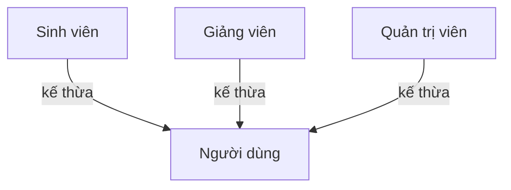
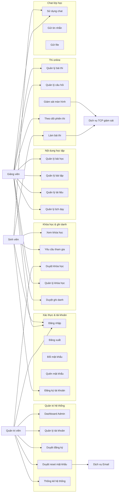

# Phân tích Actor và Use Case hệ thống CourseGuard

Tài liệu này đề xuất các actor, use case chính và quan hệ include/extend dựa trên source code hiện tại của CourseGuard. Mức phân tích tập trung vào nghiệp vụ chính, không tách quá chi tiết các hàm kỹ thuật nội bộ.

## 1. Căn cứ phân tích

Các nhóm chức năng được suy ra từ các controller/service chính trong source code:

- `AuthController`: đăng nhập, đăng ký, quên mật khẩu, đổi mật khẩu, đăng xuất, ghi log.
- `UserController`: quản lý tài khoản, duyệt đăng ký, reset mật khẩu, dashboard Admin.
- `CourseController`: quản lý khóa học, duyệt khóa học, ghi danh, rút khóa học, lịch học sinh viên.
- `TeacherController`: nghiệp vụ giảng viên như khóa học, bài học, bài tập, bài thi, câu hỏi, điểm, tài liệu, lịch dạy.
- `ChatController`: danh sách lớp chat, xem/gửi tin nhắn, gửi file.
- `DashboardController`: thống kê đăng nhập, khóa học, tài khoản.
- Các service/repository liên quan: gửi email, lưu file chat, thông báo, giám sát màn hình phiên thi.

## 2. Actor của hệ thống

| STT | Actor | Mô tả | Vai trò trong hệ thống |
|---:|---|---|---|
| 1 | Người dùng | Actor tổng quát đại diện cho mọi tài khoản sử dụng hệ thống. | Thực hiện các chức năng chung như đăng nhập, đăng xuất, đổi mật khẩu, quên mật khẩu. |
| 2 | Sinh viên | Người học tham gia các khóa học và bài thi. | Đăng ký tài khoản, tìm kiếm/tham gia khóa học, xem lịch học, chat lớp học, làm bài thi. |
| 3 | Giảng viên | Người tạo và quản lý nội dung giảng dạy. | Quản lý khóa học, bài học, bài tập, bài thi, câu hỏi, tài liệu, sinh viên, điểm và phiên thi. |
| 4 | Quản trị viên | Người có quyền quản trị hệ thống. | Quản lý tài khoản, duyệt yêu cầu, duyệt khóa học, xem thống kê và quản lý dữ liệu cấp hệ thống. |
| 5 | Dịch vụ Email | Hệ thống ngoài/secondary actor dùng để gửi email. | Gửi mật khẩu tạm thời khi Admin duyệt yêu cầu quên mật khẩu. |
| 6 | Cơ sở dữ liệu PostgreSQL/Supabase | Hệ thống lưu trữ dữ liệu. | Lưu tài khoản, khóa học, ghi danh, bài thi, câu hỏi, điểm, chat, log và thông báo. |
| 7 | Dịch vụ giám sát màn hình TCP | Thành phần kỹ thuật phục vụ giám sát thi online. | Nhận/gửi frame màn hình và cập nhật trạng thái giám sát trong phiên thi. |

### Quan hệ kế thừa actor đề xuất

> Trong use case diagram UML, `Sinh viên`, `Giảng viên`, `Quản trị viên` có thể được mô hình hóa là các specialization của actor `Người dùng`, vì đều dùng chung các chức năng xác thực.

## 3. Use case chung cho người dùng

| Mã | Use case | Actor chính | Mô tả ngắn |
|---|---|---|---|
| UC-01 | Đăng nhập | Người dùng | Xác thực tài khoản bằng username/password và thiết lập phiên làm việc. |
| UC-02 | Đăng xuất | Người dùng | Kết thúc phiên đăng nhập hiện tại. |
| UC-03 | Đổi mật khẩu | Người dùng | Đổi mật khẩu khi đã đăng nhập. |
| UC-04 | Gửi yêu cầu quên mật khẩu | Người dùng | Gửi yêu cầu reset mật khẩu bằng username và email. |
| UC-05 | Ghi nhận hoạt động người dùng | Người dùng, Hệ thống | Lưu log các hoạt động quan trọng như đăng nhập, đăng xuất, đổi mật khẩu. |
| UC-06 | Sử dụng chat lớp học | Sinh viên, Giảng viên | Truy cập phòng chat của các khóa học mà người dùng có quyền tham gia. |
| UC-07 | Gửi tin nhắn văn bản | Sinh viên, Giảng viên | Gửi nội dung chat vào phòng chat khóa học. |
| UC-08 | Gửi file trong chat | Sinh viên, Giảng viên | Gửi tài liệu/file vào phòng chat khóa học. |

## 4. Use case của Sinh viên

| Mã | Use case | Mô tả ngắn |
|---|---|---|
| UC-S01 | Đăng ký tài khoản sinh viên | Sinh viên tạo tài khoản mới với trạng thái chờ Admin duyệt. |
| UC-S02 | Xem danh sách khóa học có thể đăng ký | Xem các khóa học đang hoạt động và sinh viên chưa tham gia. |
| UC-S03 | Gửi yêu cầu tham gia khóa học | Gửi yêu cầu ghi danh vào khóa học. |
| UC-S04 | Xem trạng thái ghi danh | Theo dõi yêu cầu đang chờ duyệt, đã duyệt, bị từ chối hoặc đã rút. |
| UC-S05 | Rút/Hủy đăng ký khóa học | Hủy yêu cầu đang chờ hoặc rút khỏi khóa học đã tham gia. |
| UC-S06 | Xem khóa học của tôi | Xem danh sách khóa học đã đăng ký/đang tham gia. |
| UC-S07 | Xem lịch học online | Xem lịch học hoặc buổi học online theo các khóa học đã tham gia. |
| UC-S08 | Làm bài thi | Tham gia bài thi online khi đủ điều kiện. |
| UC-S09 | Gửi màn hình khi thi | Gửi frame màn hình để phục vụ giám sát phiên thi. |
| UC-S10 | Xem kết quả học tập | Xem kết quả/điểm sau khi làm bài hoặc được giảng viên cập nhật. |

## 5. Use case của Giảng viên

| Mã | Use case | Mô tả ngắn |
|---|---|---|
| UC-T01 | Xem dashboard giảng viên | Xem số liệu tổng quan liên quan đến khóa học, sinh viên, bài thi. |
| UC-T02 | Quản lý hồ sơ giảng viên | Xem và cập nhật thông tin hồ sơ cá nhân. |
| UC-T03 | Quản lý khóa học | Tạo, xem, cập nhật, xóa khóa học của giảng viên. |
| UC-T04 | Gửi khóa học chờ duyệt | Gửi khóa học cho Admin xét duyệt trước khi mở cho sinh viên. |
| UC-T05 | Quản lý bài học | Tạo, xem, sửa, xóa bài học trong khóa học. |
| UC-T06 | Quản lý bài tập | Tạo, xem, sửa, xóa bài tập. |
| UC-T07 | Quản lý tài liệu học tập | Tạo, xem, sửa, xóa tài liệu học tập. |
| UC-T08 | Quản lý lịch dạy | Tạo, xem, sửa, xóa lịch dạy/lịch học online. |
| UC-T09 | Quản lý bài thi | Tạo, xem, sửa, xóa bài thi. |
| UC-T10 | Quản lý câu hỏi thi | Tạo, xem, sửa, xóa câu hỏi thuộc bài thi. |
| UC-T11 | Kiểm tra điều kiện kích hoạt bài thi | Kiểm tra bài thi có thể chuyển sang trạng thái hoạt động hay chưa. |
| UC-T12 | Quản lý sinh viên ghi danh | Xem, duyệt hoặc từ chối yêu cầu tham gia khóa học. |
| UC-T13 | Xem và cập nhật điểm | Xem kết quả học tập và cập nhật điểm cho sinh viên. |
| UC-T14 | Theo dõi phiên thi đang hoạt động | Xem các phiên thi đang diễn ra. |
| UC-T15 | Giám sát màn hình thi | Nhận và theo dõi màn hình sinh viên trong phiên thi online. |

## 6. Use case của Quản trị viên

| Mã | Use case | Mô tả ngắn |
|---|---|---|
| UC-A01 | Xem dashboard Admin | Xem số liệu tổng quan về tài khoản, khóa học và hoạt động hệ thống. |
| UC-A02 | Quản lý tài khoản người dùng | Tìm kiếm, lọc, tạo, xóa tài khoản người dùng. |
| UC-A03 | Duyệt đăng ký tài khoản | Kích hoạt tài khoản sinh viên đang chờ duyệt. |
| UC-A04 | Duyệt yêu cầu quên mật khẩu | Xử lý yêu cầu reset mật khẩu và gửi mật khẩu tạm thời qua email. |
| UC-A05 | Từ chối yêu cầu người dùng | Từ chối đăng ký hoặc yêu cầu liên quan đến tài khoản. |
| UC-A06 | Đặt lại mật khẩu người dùng | Admin đặt lại mật khẩu cho tài khoản. |
| UC-A07 | Quản lý khóa học cấp hệ thống | Thêm, sửa, xóa khóa học ở quyền Admin. |
| UC-A08 | Duyệt khóa học | Duyệt khóa học do giảng viên gửi lên để chuyển sang trạng thái hoạt động. |
| UC-A09 | Từ chối khóa học | Từ chối khóa học và ghi nhận lý do. |
| UC-A10 | Ghi danh sinh viên vào khóa học | Admin thêm sinh viên vào khóa học. |
| UC-A11 | Duyệt/Từ chối ghi danh | Xử lý yêu cầu tham gia khóa học của sinh viên. |
| UC-A12 | Xem thống kê hệ thống | Xem thống kê tần suất đăng nhập, danh sách khóa học và tổng hợp tài khoản. |
| UC-A13 | Xem hoạt động gần đây | Xem log đăng nhập/hoạt động gần nhất của người dùng. |

## 7. Quan hệ include

Quan hệ `include` được dùng khi một use case luôn gọi hoặc luôn cần một bước con dùng chung.

| Use case chính | Include | Lý do |
|---|---|---|
| Đăng nhập | Ghi nhận hoạt động người dùng | Sau khi đăng nhập, hệ thống có ghi nhận thông tin thiết bị/IP hoặc log hoạt động. |
| Đăng xuất | Ghi nhận hoạt động người dùng | Khi đăng xuất, hệ thống ghi log `LOGOUT`. |
| Đổi mật khẩu | Ghi nhận hoạt động người dùng | Sau khi đổi mật khẩu thành công, hệ thống ghi log `CHANGE_PASSWORD`. |
| Đăng ký tài khoản sinh viên | Ghi nhận hoạt động người dùng | Khi tạo yêu cầu đăng ký, hệ thống ghi log `SIGNUP`. |
| Gửi yêu cầu quên mật khẩu | Ghi nhận hoạt động người dùng | Khi gửi yêu cầu reset, hệ thống ghi log `FORGOT_PASSWORD`. |
| Duyệt yêu cầu quên mật khẩu | Gửi email reset mật khẩu | Admin duyệt reset mật khẩu thì hệ thống gửi mật khẩu tạm thời qua email. |
| Duyệt yêu cầu quên mật khẩu | Ghi nhận hoạt động người dùng | Sau khi xử lý, hệ thống ghi log `FORGOT_PASSWORD_APPROVED`. |
| Quản lý tài khoản người dùng | Tìm kiếm/Lọc người dùng | Trong quá trình quản lý, Admin cần xem/lọc danh sách tài khoản. |
| Quản lý tài khoản người dùng | Tạo tài khoản người dùng | Tạo tài khoản là một hành động con của quản lý tài khoản. |
| Quản lý tài khoản người dùng | Xóa tài khoản người dùng | Xóa tài khoản là một hành động con của quản lý tài khoản. |
| Quản lý khóa học | Tạo khóa học | Tạo khóa học là một thao tác con trong quản lý khóa học. |
| Quản lý khóa học | Cập nhật khóa học | Cập nhật khóa học là một thao tác con trong quản lý khóa học. |
| Quản lý khóa học | Xóa khóa học | Xóa khóa học là một thao tác con trong quản lý khóa học. |
| Gửi khóa học chờ duyệt | Kiểm tra quyền sở hữu khóa học | Giảng viên chỉ được gửi khóa học thuộc quyền quản lý của mình. |
| Duyệt khóa học | Tạo thông báo | Khi Admin duyệt khóa học, hệ thống gửi thông báo cho giảng viên. |
| Từ chối khóa học | Tạo thông báo | Khi Admin từ chối khóa học, hệ thống gửi thông báo kèm lý do cho giảng viên. |
| Gửi yêu cầu tham gia khóa học | Kiểm tra trạng thái khóa học | Chỉ khóa học `ACTIVE` mới được gửi yêu cầu tham gia. |
| Gửi yêu cầu tham gia khóa học | Kiểm tra trạng thái ghi danh | Hệ thống kiểm tra sinh viên đã đăng ký, đã rút hoặc bị từ chối chưa. |
| Gửi yêu cầu tham gia khóa học | Tạo thông báo | Sau khi gửi yêu cầu, hệ thống thông báo cho giảng viên. |
| Duyệt/Từ chối ghi danh | Xem danh sách ghi danh chờ duyệt | Giảng viên/Admin cần xem danh sách trước khi xử lý. |
| Quản lý bài thi | Quản lý câu hỏi thi | Bài thi cần có câu hỏi để phục vụ thi và kích hoạt. |
| Kiểm tra điều kiện kích hoạt bài thi | Kiểm tra câu hỏi thi | Bài thi cần đủ câu hỏi/điều kiện trước khi kích hoạt. |
| Làm bài thi | Kiểm tra quyền làm bài thi | Sinh viên phải đủ điều kiện mới được vào bài thi. |
| Làm bài thi | Chấm điểm bài thi | Sau khi nộp bài, hệ thống/service tính điểm. |
| Giám sát màn hình thi | Nhận stream màn hình sinh viên | Giám sát cần dữ liệu màn hình từ sinh viên. |
| Gửi màn hình khi thi | Kết nối dịch vụ TCP | Client sinh viên cần kết nối đến dịch vụ giám sát. |
| Sử dụng chat lớp học | Lấy danh sách khóa học có chat | Người dùng phải chọn lớp/khóa học có quyền truy cập. |
| Sử dụng chat lớp học | Xem tin nhắn | Chat lớp học bao gồm việc xem nội dung tin nhắn. |
| Gửi tin nhắn văn bản | Kiểm tra quyền truy cập phòng chat | Chỉ người thuộc khóa học hoặc có quyền mới được gửi tin. |
| Gửi tin nhắn văn bản | Ghi nhận hoạt động người dùng | Sau khi gửi tin, hệ thống ghi log `CHAT_USE`. |
| Gửi file trong chat | Kiểm tra quyền truy cập phòng chat | Chỉ người có quyền trong khóa học mới được gửi file. |
| Gửi file trong chat | Kiểm tra file chat | File phải tồn tại, không rỗng, đúng định dạng, không quá 20MB. |
| Gửi file trong chat | Lưu file chat | File hợp lệ được lưu vào storage cục bộ. |
| Gửi file trong chat | Ghi nhận hoạt động người dùng | Sau khi gửi file, hệ thống ghi log `CHAT_USE`. |
| Xem dashboard Admin | Xem thống kê hệ thống | Dashboard dùng dữ liệu thống kê tài khoản/khóa học/đăng nhập. |
| Xem dashboard giảng viên | Tổng hợp dữ liệu giảng viên | Dashboard giảng viên gồm tổng hợp khóa học, bài thi, sinh viên. |

## 8. Quan hệ extend

Quan hệ `extend` được dùng khi một use case mở rộng luồng chính trong một điều kiện nhất định.

| Use case mở rộng | Extend use case | Điều kiện mở rộng |
|---|---|---|
| Đăng ký tài khoản sinh viên | Đăng nhập | Người dùng chưa có tài khoản nên chọn đăng ký thay vì đăng nhập. |
| Gửi yêu cầu quên mật khẩu | Đăng nhập | Người dùng không nhớ mật khẩu khi đăng nhập. |
| Đổi mật khẩu | Đăng nhập | Sau khi đăng nhập, người dùng có thể chủ động đổi mật khẩu. |
| Gửi lại yêu cầu tham gia khóa học | Gửi yêu cầu tham gia khóa học | Sinh viên từng bị từ chối (`REJECTED`) và gửi lại yêu cầu. |
| Hủy yêu cầu tham gia khóa học | Rút/Hủy đăng ký khóa học | Enrollment đang ở trạng thái `PENDING`. |
| Rút khỏi khóa học | Rút/Hủy đăng ký khóa học | Enrollment đang ở trạng thái đã được duyệt/tham gia. |
| Duyệt đăng ký tài khoản | Duyệt yêu cầu người dùng | Yêu cầu có loại/trạng thái đăng ký mới. |
| Duyệt yêu cầu quên mật khẩu | Duyệt yêu cầu người dùng | Yêu cầu có trạng thái `RESET_REQUEST`. |
| Từ chối yêu cầu người dùng | Duyệt yêu cầu người dùng | Admin chọn từ chối thay vì duyệt. |
| Đặt lại mật khẩu người dùng | Quản lý tài khoản người dùng | Admin cần can thiệp mật khẩu cho tài khoản cụ thể. |
| Duyệt khóa học | Xử lý khóa học chờ duyệt | Admin chọn chấp nhận khóa học đang `PENDING`. |
| Từ chối khóa học | Xử lý khóa học chờ duyệt | Admin chọn từ chối khóa học đang `PENDING`. |
| Gửi khóa học chờ duyệt | Quản lý khóa học | Khóa học do giảng viên tạo cần được công khai cho sinh viên. |
| Duyệt ghi danh | Xử lý yêu cầu ghi danh | Admin/Giảng viên chọn chấp nhận yêu cầu. |
| Từ chối ghi danh | Xử lý yêu cầu ghi danh | Admin/Giảng viên chọn từ chối yêu cầu. |
| Gửi file trong chat | Sử dụng chat lớp học | Người dùng chọn gửi kèm file thay vì chỉ nhắn văn bản. |
| Theo dõi phiên thi đang hoạt động | Quản lý bài thi | Khi có phiên thi đang diễn ra, giảng viên có thể theo dõi. |
| Giám sát màn hình thi | Theo dõi phiên thi đang hoạt động | Khi phiên thi yêu cầu giám sát, hệ thống hiển thị/nhận màn hình sinh viên. |
| Cập nhật điểm thủ công | Xem và cập nhật điểm | Giảng viên cần điều chỉnh điểm sau khi xem kết quả. |

## 9. Nhóm use case theo sơ đồ tổng quát

Có thể vẽ use case diagram ở mức tổng quát với các nhóm sau:

## 10. Gợi ý trình bày trong báo cáo

Khi đưa vào báo cáo đồ án, có thể trình bày theo thứ tự:

1. Liệt kê actor và mô tả actor.
2. Vẽ sơ đồ use case tổng quát gồm 3 actor chính: Sinh viên, Giảng viên, Quản trị viên.
3. Tách thêm 3 sơ đồ con nếu cần:
   - Use case quản trị hệ thống.
   - Use case quản lý khóa học/giảng dạy.
   - Use case sinh viên và thi online.
4. Bảng hóa quan hệ `include`/`extend` như trong tài liệu này để giải thích rõ luồng nghiệp vụ.
